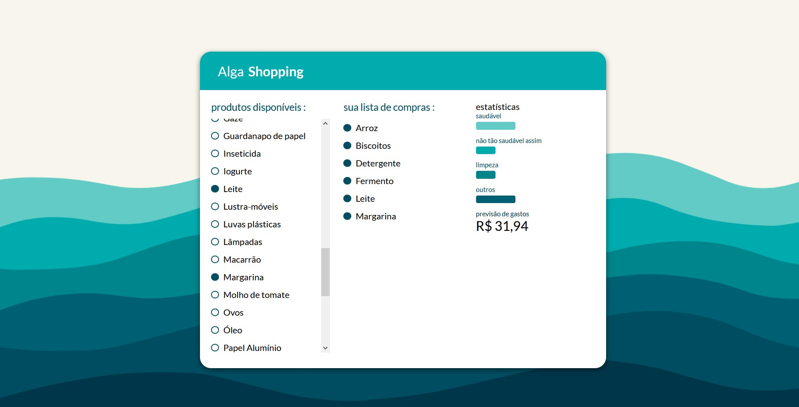

<div align="center">

</div>
<br/>
<h3 align="center">Project developed in 2 days during "AlgaWorks - Desafio React" </h3>
<br/>

# :computer: Technologies

- Javascript
- React Js

# :video_game: Run

```bash
    # Clone repository
    $ git clone https://github.com/kitkoshino/nlw-02.git
```

### Run Project

```bash
    #Instalar dependências:
    $ npm install

    # Rodar Aplicação:
    $ npm start
```
